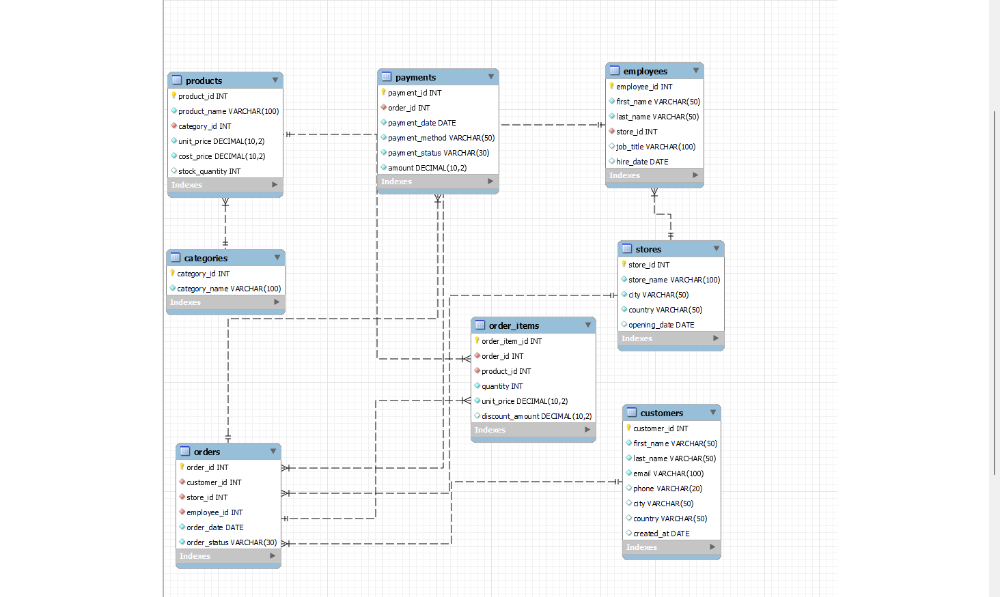
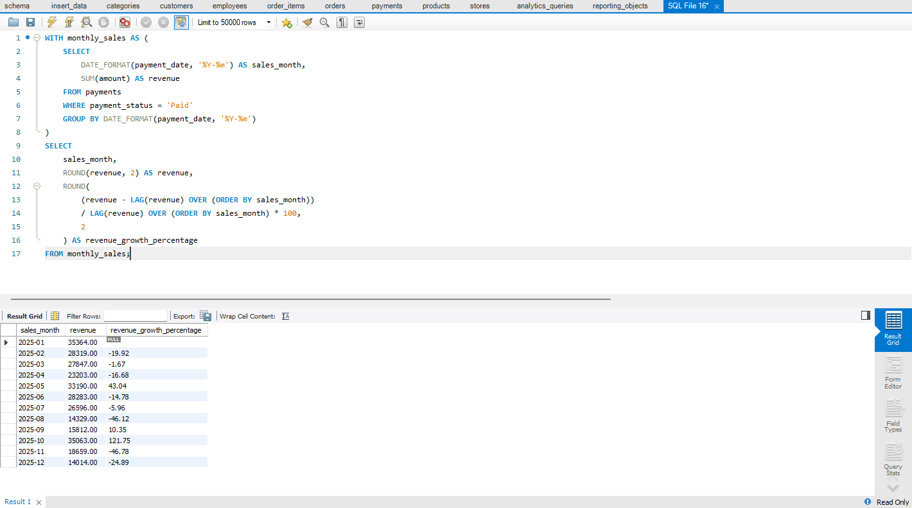
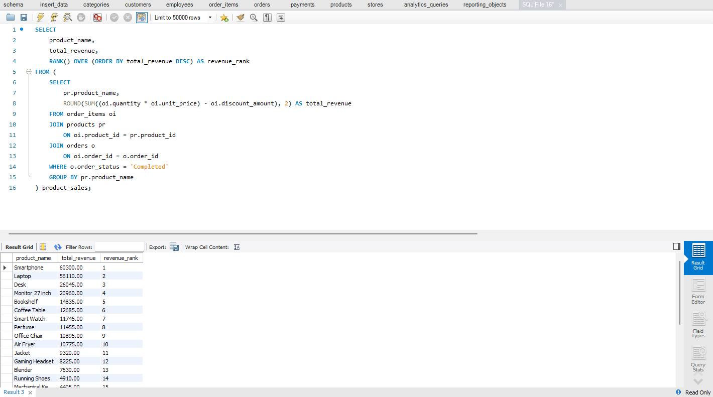
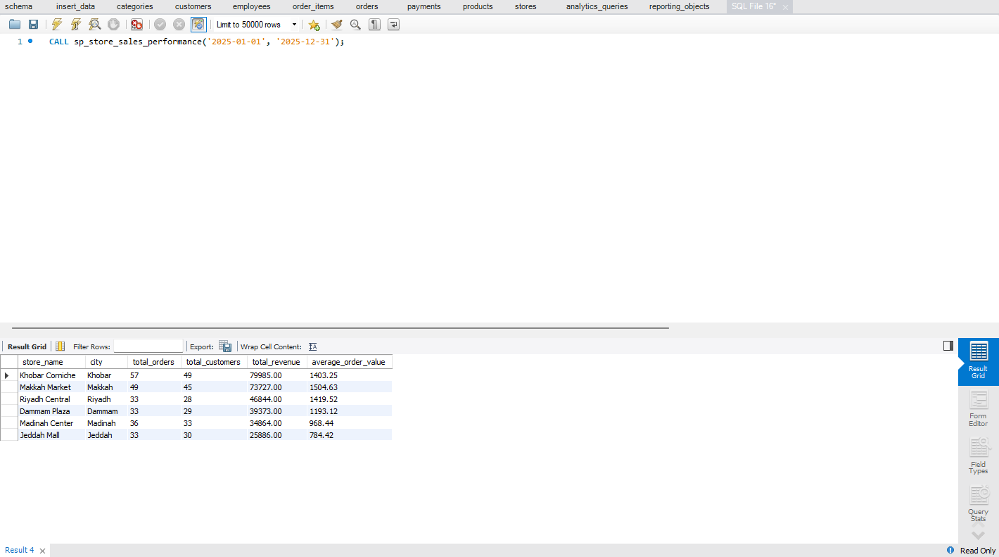
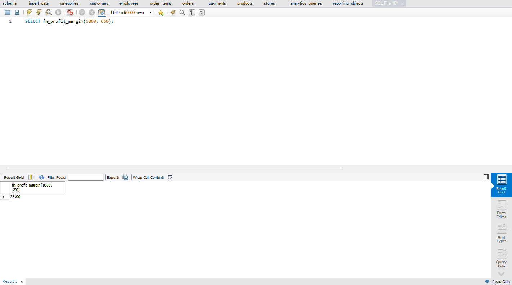
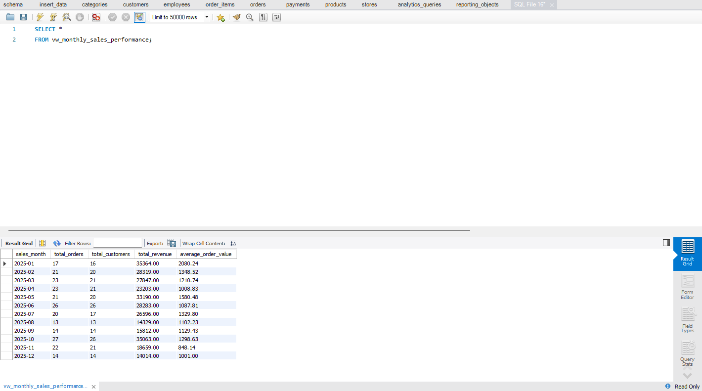
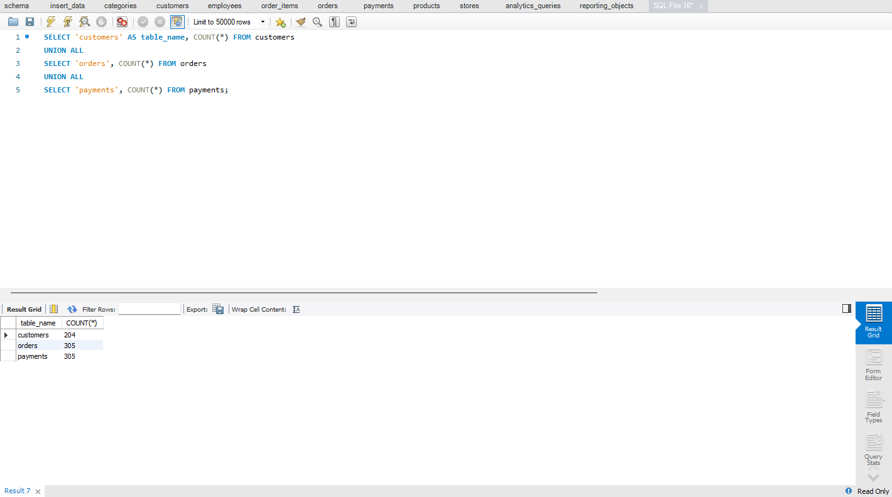

# Retail Sales SQL Analytics System

## Project Overview

This project focuses on designing and analyzing a complete Retail Sales Database Architecture using SQL and relational database modeling techniques in MySQL Workbench.

The project simulates a real-world Business Intelligence and Retail Analytics workflow including:

- Database schema design
- Relational database modeling
- Transactional data management
- Data importing and preprocessing
- Business KPI analysis
- Revenue and profitability analysis
- Customer and product analytics
- Reporting layer creation
- SQL programming objects

The main objective of this project is to build a scalable and analytics-ready retail database system while generating meaningful business insights using SQL.

---

# Business Problem

Retail businesses often face challenges in:

- Tracking revenue performance
- Monitoring product sales trends
- Understanding customer purchasing behavior
- Evaluating store performance
- Measuring employee sales contribution
- Managing transactional business data
- Generating analytical business reports

This project addresses these challenges through SQL-based business analysis and relational database modeling.

---

# Project Architecture

This project follows a normalized relational database structure designed for transactional processing and analytical reporting.

## Core Business Tables

- `customers`
- `products`
- `categories`
- `stores`
- `employees`
- `orders`
- `order_items`
- `payments`

This structure improves:

- Query performance
- Data organization
- Reporting efficiency
- Analytical scalability

---

# Schema Design



---

# SQL Workflow

The project was developed through multiple SQL stages:

```text
schema.sql
insert_data.sql
analytics_queries.sql
reporting_objects.sql
```

---

# Database Schema Creation

The project begins with creating a complete relational retail database system used to store transactional business data.

Main entities include:

- Customer Information
- Product Information
- Store Information
- Employee Information
- Order Transactions
- Order Item Details
- Payment Transactions

The database includes:

- Primary Keys
- Foreign Keys
- Constraints
- Transactional Relationships
- Data Integrity Rules

---

# Query Result Screenshots

## Monthly Revenue Growth



---

## Product Revenue Ranking



---

## Stored Procedure Output



---

## Function Execution



---

## View Output



---

## Database Volume



---

# Tools & Technologies

- MySQL
- MySQL Workbench
- SQL
- Relational Database Modeling
- Business Intelligence Concepts
- Data Analytics

---

# Folder Structure

```text
retail-sales-sql-analytics/
│
├── datasets/
├── screenshots/
├── sql_queries/
└── README.md
```

---

# Author

## Yahya Sleiman

Aspiring Data Analyst passionate about:

- SQL
- Power BI
- Python
- Data Analytics
- Business Intelligence
- Data Storytelling

### Connect With Me

- LinkedIn: www.linkedin.com/in/yahya-sleiman-6b742a356
- GitHub: https://github.com/yahya-slmn

---

# Project Status

Completed and added as part of my Data Analytics portfolio projects.

